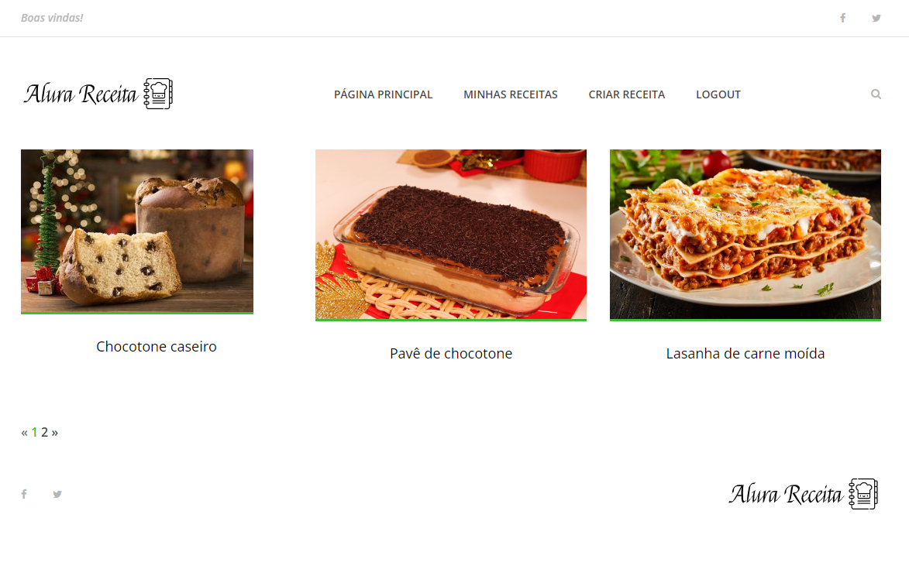
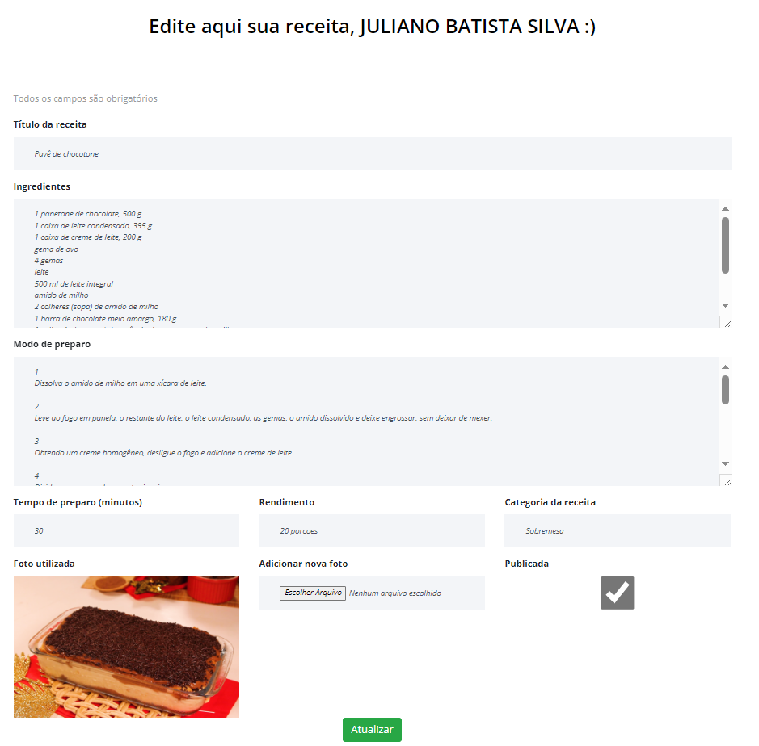

# Receitas

Este projeto consiste em um site de receitas desenvolvido durante o curso da Alura.

## Objetivo
O propósito deste projeto é criar e gerenciar receitas por meio de um banco de dados. Para atingir esse objetivo, o projeto utiliza formulários para entrada de dados e autenticação para assegurar a integridade do sistema. Além disso, o site permite a exibição e o armazenamento de imagens associadas às receitas.

## Tecnologias Utilizadas
- **HTML, CSS e JS:** Utilizados para integração entre arquivos e implementação de funcionalidades no frontend.
- **Banco de dados SQLite3:** Responsável pelo armazenamento das receitas.
- **Formulários:** Facilitam a entrada de dados por parte do usuário.
- **Autenticação:** Garante a segurança do sistema.

## Instalação
Para instalar as dependências necessárias, execute o seguinte comando:

```bash
pip install -r requirements.txt
```

Certifique-se de que o banco de dados SQLite3 local já está incluso no projeto. Se preferir utilizar um banco de dados diferente, modifique as configurações no arquivo `settings` do projeto.

## Executando o Projeto
Após a instalação das dependências, execute o projeto e comece a criar e armazenar suas receitas!

## Demonstração do Funcionamento
Aqui estão duas imagens que ilustram o funcionamento do site:


*Legenda: Página principal exibindo uma variedade de receitas.*


*Legenda: Formulário de criação de receita, facilitando a entrada de informações.*

## Créditos
Este projeto foi desenvolvido durante o curso da Alura. Agradecemos à Alura pela oportunidade de aprendizado.

**Aproveite suas experiências culinárias!**